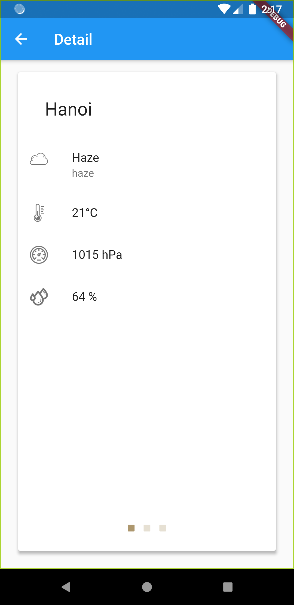

> # **Weather Flutter MVVM**

## Get API from http://openweathermap.org/

 

## **Getting Started**

 

### **Main Screen**

  

### **1. Search Screen**

Click icon **`Kính lúp`**, sẽ chuyển đến màn hình tìm kiếm. Nhập vào ô tìm kiếm vị trí muốn tìm và tìm, màn hình sẽ hiện ra 1 box bao gồm tên vị trí vừa tìm **`thời tiết`** và **`nhiệt độ`** hiện tại ở đó _(độ C)_.

Click icon **`Heart`** trên màn hình để lưu trữ địa điểm yêu thích của bạn ra ngoài màn hình chính

  

### **2. Main Screen**

Lúc này màn hình chính sẽ hiển thị những vị trí mà bạn đã yêu thích để có thuân tiện cho việc theo dõi thời tiết tại khu vực đó

  

### **2. Detail Screen**

Click vào 1 địa điểm bất kì trong danh sách đã lưu, sẽ chuyển đến màn hình **`Detail`**, trang này sẽ hiển thị chi tiết thời tiết hiện tại nơi này gồm: **`thời tiết, nhiệt độ, độ ẩm và áp suất không khí`**

  

### **3. History Screen**

Khi click vào icon **`đồng hồ`** trên thanh appBar, sẽ chuyển đến màn hình lịch sử tìm kiếm, màn hình này hiển thị tất cả những vị trí mà người dùng đã tìm kiếm trước đó

  

### **4. Delete Screen**

Click và giữ vào 1 box bất kì trên **`màn hình chính, màn hình tìm kiếm và lịch sử`**, lập tức 1 modal sẽ xuất hiện và hỏi bạn có muốn xóa vị trí đã chọn không và yêu cầu bạn xác nhận lại việc xóa này để tránh nhầm lẫn

  

 
 

# Thanks For Watching
